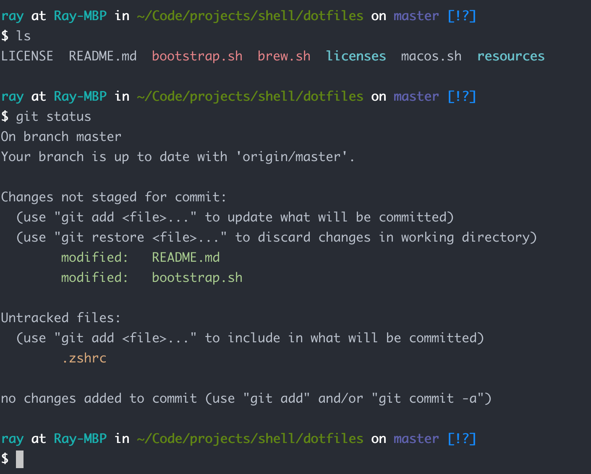

# dotfiles



---

我的 dotfiles，以 [mathiasbynens/dotfiles](https://github.com/mathiasbynens/dotfiles) 为基础，主要适配我个人的 **MacOS** 开发环境。如果你想基于此库配置你自己的 dotfiles，可以直接 fork 本仓库并进行修改。如果你想直接使用本仓库的 dotfiles，参考下文的 **安装** 一节。

## 安装

> 注意：稳妥的做法是 Fork 本仓库，查看源码并确保你已了解每个文件中每行代码的真正含义，然后根据自己需要添加或移除相关代码。**所有风险请自行承担**。

### 使用 Git 和 `bootstrap.sh` 脚本

你可以克隆此仓库到任意位置，初始化脚本会自动拉取最新的代码并且复制所有相关文件到你的 Home 目录。

```bash
git clone https://github.com/rayyh/dotfiles.git && cd dotfiles && source bootstrap.sh
```

如果你想更新到最新版本，进入 `dotfiles` 目录，然后执行：

```bash
source bootstrap.sh
```

如果想忽略任何提示信息，可以输入：

```bash
set -- -f; source bootstrap.sh
```

### 不使用 Git 安装

```bash
cd; curl -#L https://github.com/rayyh/dotfiles/tarball/master | tar -xzv --strip-components 1 --exclude={README.md,bootstrap.sh,LICENSE,licenses,brew.sh,resources,.zshrc}
```

### 使用 `.path` 文件来扩展路径变量

你可以通过 `~/.path` 文件来定义你的路径变量，下面是一个示例：

```bash
export PATH="/usr/local/bin:$PATH"
export PATH="/usr/local/sbin:$PATH"
```

### 在不 fork 的情况下添加自定义命令

你可以在 `~/.extra` 文件中添加自定义命令，比如 Git 的用户配置信息。下面是我的 `.extra` 示例：

```bash
# Git 凭证，不包含在此仓库中
GIT_AUTHOR_NAME="rayyh"
GIT_COMMITTER_NAME="$GIT_AUTHOR_NAME"
git config --global user.name "$GIT_AUTHOR_NAME"
GIT_AUTHOR_EMAIL="rayyounghong@gmail.com"
GIT_COMMITTER_EMAIL="$GIT_AUTHOR_EMAIL"
git config --global user.email "$GIT_AUTHOR_EMAIL"
```

### 默认镜像

众所周知，在国内通过 composer/npm/yarn 安装依赖时下载速度特别慢，因此本库提供了一些国内源默认的配置文件。如果不需要配置国内源，可以通过 `.functions` 文件中定义的重置方法进行重置。

> 可以从 [Mirrors](https://github.com/RayYH/cheatsheets/blob/master/src/mirrors.md) 中获取更多关于国内镜像的信息。

```bash
# 设置源
set_brew_mirror
set_composer_mirror
set_npm_mirror
set_yarn_mirror
# 重置源
reset_brew_mirror
reset_composer_mirror
reset_npm_mirror
reset_yarn_mirror
```

> 注意：`pypi` 源写在 `.pip/pip.conf` 文件中，重置 `pypi` 源，直接删除该配置文件即可。

### 代理端口

`usep` 方法用于在终端配置代理相关的 `ftp_proxy/http_proxy/https_proxy` 环境变量，默认的端口给的是 1087，你可以在 `.extra` 文件中重写此方法。

### `.vimrc` ?

我使用 [amix/vimrc](https://github.com/amix/vimrc)，并且做了部分修改。你可以使用 `updateVimrc` 更新仓库，如果报丢失 `requests` 库，尝试如下命令：

```bash
# python2
sudo easy_install pip
pip install --user requests

# python3
pip3 install --user requests
```

## 致谢

- [mathiasbynens/dotfiles](https://github.com/mathiasbynens/dotfiles) - [LICENSE](licenses/mathiasbynens_dotfiles_mit)
- [natelandau/.bash_profile](https://gist.github.com/natelandau/10654137)

## License

[MIT](LICENSE).
